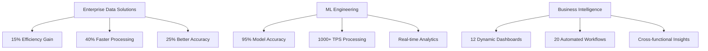

<div align="center">


</div>

<div align="center">

[](https://git.io/typing-svg)

</div>

---

## 🎯 **Professional Overview**

**Enterprise Data Solutions Expert** with **4+ years** of proven experience architecting scalable data solutions that drive measurable business impact. Currently leading analytics initiatives at **NAVCO Industries**, where I've delivered **15% operational efficiency improvements** and **40% reduction in data processing time** through innovative ML pipelines and automated workflows.

<div align="center">

```ascii
     📊 Data Architecture    🤖 ML Engineering    📈 Business Intelligence
         ⬇️                        ⬇️                       ⬇️
    ├─ ETL Pipelines         ├─ Fraud Detection      ├─ Real-time Dashboards
    ├─ Cloud Infrastructure  ├─ Predictive Models    ├─ KPI Automation  
    ├─ Data Quality          ├─ MLOps & Deployment   ├─ Executive Reporting
    └─ 5TB+ Daily Processing └─ 95% Accuracy Rate    └─ Cross-functional Insights
```

</div>

---

## 🛠️ **Technology Stack**

<div align="center">

### **Core Programming & Data Science**


### **Machine Learning & AI**


### **Cloud & Big Data**


### **Business Intelligence & Visualization**


### **DevOps & Development**


</div>

---

## 📊 **GitHub Analytics & Activity**

<div align="center">


</div>

<div align="center">


</div>

<div align="center">


</div>

---

## 🚀 **Featured Projects**

<div align="center">

### **🔐 Dynamic Fraud Detection System**
[](https://github.com/venkatakhilmettu/dynamic-fraud-detection)

**Key Impact:** 95% accuracy, 1000+ TPS processing | **Tech:** Python, Scikit-learn, Flask, Docker

---

### **🏥 Clinical Decision Support System**
[](https://github.com/venkatakhilmettu/clinical-decision-support)

**Key Impact:** 90% mortality prediction accuracy | **Tech:** Python, MIMIC Data, Gradient Boosting

---

### **💹 Forex Analysis & Prediction Platform**
[](https://github.com/venkatakhilmettu/forex-analysis-prediction)

**Key Impact:** Real-time trend analysis & ARIMA forecasting | **Tech:** Python, Streamlit, Time Series

---

### **🌍 AI Sustainability Risk Intelligence**
[](https://github.com/venkatakhilmettu/sustainability-risk-intelligence)

**Key Impact:** Real-time ESG analytics dashboard | **Tech:** Streamlit, NLP, Sentiment Analysis

</div>

---

## 🏆 **Professional Achievements**

<div align="center">

| **Metric** | **Achievement** | **Business Impact** |
|:---:|:---:|:---:|
| 🚀 | **Operational Efficiency** | +15% improvement |
| ⚡ | **Data Processing Speed** | -40% processing time |
| 📊 | **Data Accuracy** | +25% improvement |
| 💾 | **Daily Data Processing** | 5TB+ capability |
| 🎯 | **ML Model Accuracy** | 95% fraud detection |
| 👥 | **Team Development** | 6+ analysts mentored |

</div>

<div align="center">



</div>

---

## 💼 **Professional Experience**

<div align="center">

### **🏢 NAVCO Industries Private Limited**
**Enterprise Data Solutions Analyst** | *Feb 2024 - Present*

```
📈 Leading enterprise analytics transformation initiatives
🔧 Architecting scalable data pipelines using AWS & Python
📊 Developing ML models for business optimization
👥 Managing cross-functional teams and stakeholder relations
```

**Data Analyst** | *Mar 2022 - May 2023*
```
📊 Built comprehensive BI dashboards and KPI tracking
🔍 Conducted advanced statistical analysis for decision support
🤖 Implemented forecasting models reducing inventory costs by 8%
```

</div>

---

## 🎓 **Education & Certifications**

<div align="center">

### **🎓 Academic Excellence**
**Master of Science in Data Science** - *Saint Peter's University* (GPA: 3.9/4.0)  
**Bachelor of Engineering** - *AVIT, India* (GPA: 3.7/4.0)

### **🏅 Professional Certifications**


</div>

---

## 🌟 **Current Focus & Research**

<div align="center">

### **🔬 Active Research Projects**
- 🏥 **Healthcare Analytics** - Research Assistant at Saint Peter's University
- 🌿 **AI-Driven Sustainability Intelligence** - Real-time ESG risk assessment
- 🧠 **Advanced NLP Applications** - Interactive news retrieval systems

### **📚 Continuous Learning**
- 🔄 **MLOps & Model Deployment** - Production-ready ML systems
- ☁️ **Cloud-Native Analytics** - Serverless data architectures
- 🤖 **Generative AI Integration** - Business applications of LLMs

</div>

---

## 📫 **Let's Connect & Collaborate**

<div align="center">

[](https://www.linkedin.com/in/venkata-akhil-mettu-51a48b277)
[](mailto:venkatakhil149@gmail.com)
[](https://public.tableau.com/app/profile/venkata.akhil.mettu)
[](https://app.powerbi.com/groups/me/reports)

### **🤝 Open to Collaboration**
- 🔬 **Enterprise Data Transformation** projects
- 🏥 **Healthcare Analytics** research initiatives
- 🌿 **Sustainability Intelligence** platforms
- 🚀 **Open-source ML tools** development

</div>

---

<div align="center">

### **💡 Professional Philosophy**

*"Transforming complex data challenges into scalable business solutions that drive measurable impact and organizational growth."*

---


---


</div>

<div align="center">


</div>
